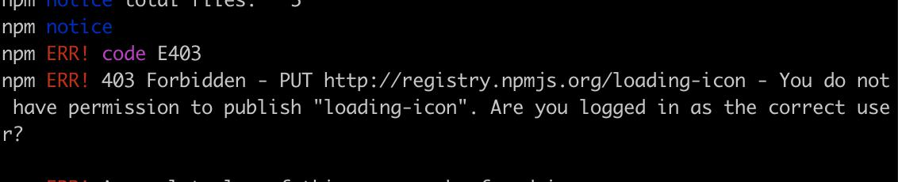
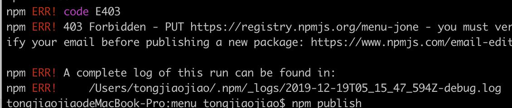
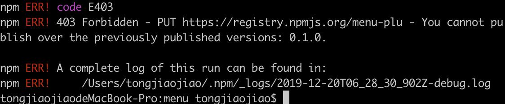

# menu

## Project setup
```
npm install
```

### Compiles and hot-reloads for development
```
npm run serve
```

### Compiles and minifies for production
```
npm run build
```

### Lints and fixes files
```
npm run lint
```

### Customize configuration
See [Configuration Reference](https://cli.vuejs.org/config/).

##自定义组件 并 发布到npm
```
具体我又在博客园中讲清楚 => (https://www.cnblogs.com/tongjiaojiao/p/10191627.html)
```


### error
```
本地组件写完想要发布至npm，可能会遇到的几个常见问题
```
#### 组件名称npm中已存在
```
package.json内的name修改为唯一就可以了
```


#### 邮箱在npm中没有激活
```
在npm中激活即可
```


#### 淘宝镜像为切回 在淘宝域内找不到该组件
#### 403 Forbidden - PUT https://registry.npm.taobao.org/react-native-hh-button-view- no_perms
```
需要切回初始的镜像  npm config set registry http://registry.npmjs.org/ 
```

### 更新之后 发布前一定要将package.json中的版本号更新 且版本号必须高于上一版本


### 需要用组件的项目，需要使用 npm i XXX的方式进行安装 因为发布的时候使用的是官方的镜像 所以安装时使用其他的镜像 会失败